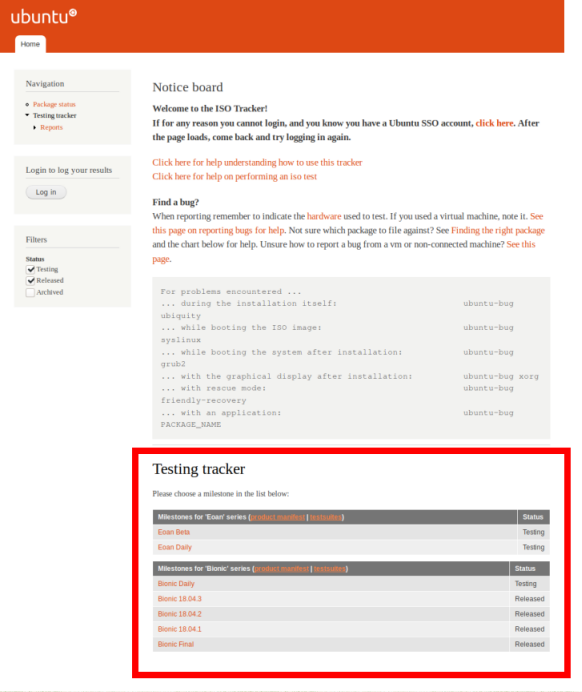
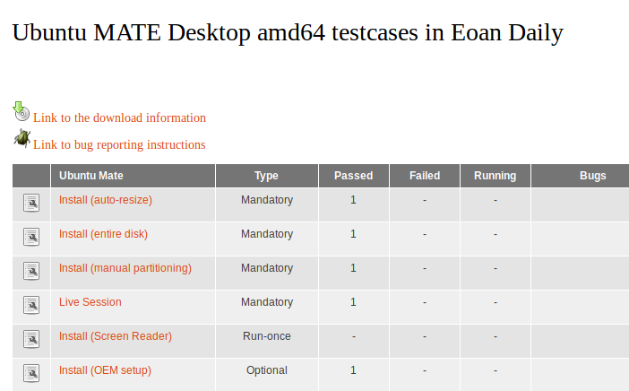

# Ubuntu MATE Quality Assurance (QA) ISO Testing Guide

Welcome to the **Ubuntu MATE** ISO Testing Guide 

**THANK YOU** for taking the time to contribute and test builds
of Ubuntu MATE.

While reading this, if you have suggestions to make this guide
better, please let us know.

## Getting Started

You will need to create a few accounts for different
services to be able to test versions of Ubuntu MATE.

#### Ubuntu ISO Tracker

You can create an Ubuntu One account here:
<https://login.launchpad.net/qGtZ05jM0QUUftoV/+login>

If you have used Launchpad, you already have an Ubuntu One account.


#### GitHub

You can create a GitHub account here:
<https://github.com/join?source=prompt-code>


Enter information. Select the free plan. Verify email.

#### Ubuntu MATE Community

You can create a community account here:
<https://ubuntu-mate.community/>


Top right corner. Sign up. Enter information. Verify email.


## Testing

Go to <http://iso.qa.ubuntu.com/qatracker> find the build you want to
test. At the bottom of the page you will see Testing tracker and a list
of options. For this guide we are going to test the daily build of “Eoan
Daily”. Click on the chosen build.



Then, on the left hand side of the new screen, we recommend filtering to
Ubuntu MATE to make it easier to find the correct build.


Next, we will need to download the build. Click on the “*Product*”.


Next, click on “Link to the download information”


There are a few options to pick from. For convenience, **we highly
recommend zsync**. It will save time and bandwidth. You will need to
install zsync.

To install *zsync*, open a terminal:

```
sudo apt-get install zsync -y
```

This is an informative YouTube video explaining how *zsync* works:

* [Use zsync to refresh daily iso files](https://www.youtube.com/watch?v=uZnAMefo0xs)

Then from the download page, you can copy the build’s *zsync* command and
paste into the terminal. Note: The build name changes everyday. Also the
first *zsync* will have to do a complete download, but after that,
future downloads of that version will be smaller in size.


After the download is completed, it is finally time to test. You can
test on anything you would like and the more testing the better, but if
you are able to, testing on physical hardware is preferred. If you are
only able to test on a virtual machine (VM), that is still very valuable.



First, you will go back to the previous page before you downloaded the
ISO. Where you will see all the test cases you can do for a ISO. You
will click on the option of the test you want to run.


The test case will give you step by step instructions on what you need
to do.

Please keep in mind that the steps are a bit old and refers to grub
version and not UEFI.


Next, if you did not find any issues (interface missing, not booting,
errors during the install process, etc) then you need to mark the test
case as passed.

1. Select Passed.
1. Leave Critical bugs and Bugs fields uncompleted.
1. In the comment section please add on what PC did you did the test (if
you ran the test in a VM please add "Tested in a VM" or if you tested on
hardware please add on what type of CPU and GPU was tested.


#### If you encounter a issue

You will need to see if it's a known issue or new. Reported known issues
for the specific ISO are in the ‘*Bugs to look for*’ section under Test
case. After reviewing all the bugs to look for, if the issue is not
listed you will need to file a bug report (see below).


After that we add to the "Add test result" section as *Failed* or *Passed* and the add the issue track number in the correct field. If it's a “blocker” issue (the ISO will not boot or install, if there is a issue with the interface), add it to the Critical bugs and mark the Result as *Failed*.

#### How to report a bug

While testing, if you encounter a issue this is [How to
report problems in Ubuntu Mate](https://ubuntu-mate.community/t/how-to-report-problems-in-ubuntu-mate/17943)


## Helpful Links

* [https://ubuntu-mate.community](https://ubuntu-mate.community/)
* [Norbert's Bug Tracker](https://docs.google.com/spreadsheets/d/1mYrDU5Z11kNXlfsOFq2E0bfJYqTRP29kL3xAT3FRbQA)
* [Ubuntu MATE Launchpad](https://launchpad.net/ubuntu-mate)
* [Ubuntu ISO Tracker](http://iso.qa.ubuntu.com/)
* [GitHub Ubuntu MATE QA](https://github.com/ubuntu-mate/qa)


## Credits and acknowledgements

This document is based on contributions from [franksmcb], [apolitech], and [mttke]

[franksmcb]: https://ubuntu-mate.community/u/franksmcb
[apolitech]: https://ubuntu-mate.community/u/apolihron
[mttke]: https://ubuntu-mate.community/u/mttke

